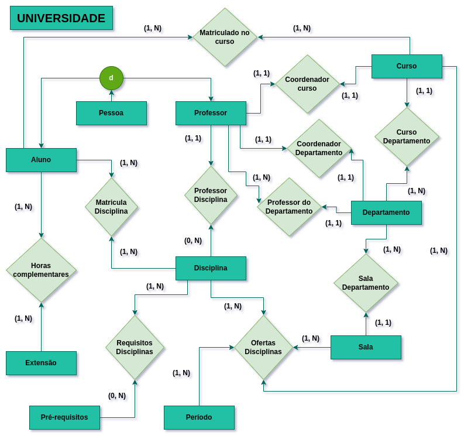
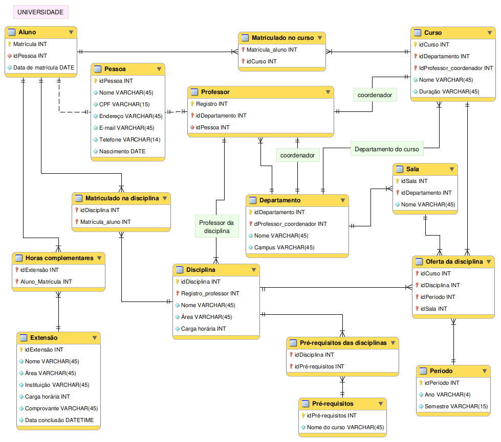

# 🏫 Modelagem de Banco de Dados: Gestão Universitária

  
  
  

 

  <h3>🌐 <a href="https://nandeslima.github.io/modelagem-universidade/">Acesse a Versão Interativa (MkDocs)</a></h3>

 

> **Objetivo:** Projetar e documentar a arquitetura de um banco de dados relacional para um sistema de gestão acadêmica, integrando o controle de matrículas, oferta de disciplinas por semestre, alocação de salas e gestão de corpo docente.

---

## 🎯 Visão Geral do Projeto

Este projeto foca na resolução de um problema clássico de arquitetura de dados: o **Ambiente Acadêmico**. O desafio foi criar uma estrutura capaz de lidar com relacionamentos muitos-para-muitos (N:M) complexos, como alunos em múltiplos cursos e disciplinas com pré-requisitos variados, garantindo a normalização e a escalabilidade do sistema.

Desenvolvido utilizando **MySQL Workbench**.

👉 **[Fazer o download do Arquivo do Modelo (.mwb)](universidade.mwb)**

---

## 📖 Levantamento de Requisitos (A Narrativa)

O sistema foi modelado para atender às seguintes diretrizes de negócio:

### 🎓 Vida Acadêmica do Aluno
- **Flexibilidade:** Alunos podem estar em múltiplos cursos de graduação simultaneamente.
- **Cursos Livres:** Suporte para registro de atividades de extensão (horas complementares).
- **Avaliação:** Sistema semestral com controle de notas (provas e trabalhos).

### 📚 Estrutura de Disciplinas
- **Exclusividade:** Cada disciplina é ministrada por um único professor por oferta.
- **Dependências:** Gestão de pré-requisitos (uma matéria pode travar várias outras).
- **Compartilhamento:** Disciplinas comuns a múltiplos cursos (ex: Cálculo I para Engenharia e TI).

### 👨‍🏫 Gestão Docente e Espacial
- **Coordenação:** Professores vinculados a departamentos e coordenações de curso.
- **Alocação:** Controle de oferta vinculando Disciplina, Período, Curso e Sala de Aula.

---

## 🏗️ Arquitetura do Sistema

### 🧩 Entidades Chave

| Grupo | Entidades | Atributos de Destaque |
| :--- | :--- | :--- |
| **Pessoas** | Pessoa, Aluno, Professor | CPF, Matrícula, Registro Funcional |
| **Acadêmico** | Disciplina, Curso, Departamento | Carga Horária, Coordenador, Campus |
| **Infra** | Sala, Período, Oferta | Nome da Sala, Semestre Letivo |
| **Extra** | Extensão | Horas, Comprovante, Instituição |

### 🔗 Principais Relacionamentos
- `[Professor] 1:N [Disciplina]`: Responsabilidade docente.
- `[Disciplina] N:M [Período/Curso/Sala]`: O nó central da oferta acadêmica.
- `[Aluno] N:M [Disciplina]`: Controle de matrículas ativas.
- `[Pré-requisito] N:M [Disciplina]`: Lógica de dependência curricular.

---

## 🗺️ Documentação Visual

### 📐 Schema Lógico/Físico (EER)
Visualização das tabelas, tipos de dados e chaves:

### 📊 Schema Conceitual (UML)
Visão abstrata das regras de negócio:

---
*Este repositório faz parte do meu portfólio de **Arquitetura de Dados**, demonstrando capacidade de transformar regras de negócio educacionais em modelos relacionais robustos, desenvolvido por **Ariel Shlomoh**.*